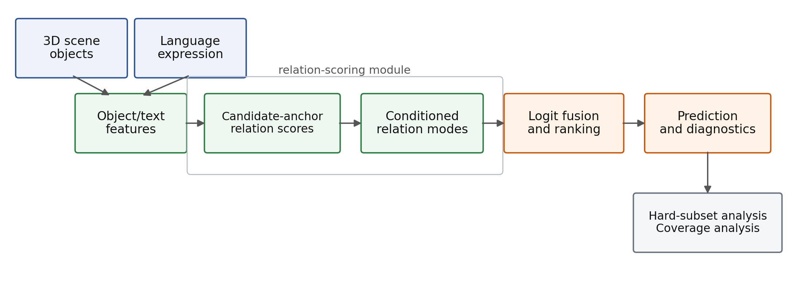

# Latent Conditioned Relation Scoring for 3D Visual Grounding

A reproducible CSC6133 final project on relation-aware 3D visual grounding, combining scene-disjoint evaluation, hard-subset and anchor-coverage diagnostics, and controlled conditioned relation-scoring ablations.



This repository is framed as a diagnostic and controlled-ablation project. It does not claim state-of-the-art performance, does not validate explicit viewpoint supervision as the causal mechanism, and does not treat multi-anchor grounding as solved.

---

## CSC6133 Final Project Report

This repository accompanies the final project report:
**Latent Conditioned Relation Scoring for 3D Visual Grounding**.

Course: CSC6133 Deep Learning for Computer Vision.

The project contributes:

1. a verified scene-disjoint Nr3D/ReferIt3D-style evaluation pipeline,
2. hard-subset and anchor-coverage diagnostics,
3. controlled conditioned relation-scoring ablations.

Report PDF: [course-line/report/report.pdf](course-line/report/report.pdf)

Report source: [course-line/report/main.tex](course-line/report/main.tex), with section files under [course-line/report/sections/](course-line/report/sections/).

Reproducibility note: [repro/COURSE_REPORT_REPRODUCIBILITY.md](repro/COURSE_REPORT_REPRODUCIBILITY.md)

---

## Quick Results Summary

These numbers come from different protocols and should not be collapsed into a single leaderboard.

### Scene-Disjoint Reproduced Baseline

| Metric | Value |
|--------|-------|
| Test samples | 4,255 |
| Acc@1 | 30.83% |
| Acc@5 | 91.87% |

### Hard-Subset Diagnostics

| Subset | Acc@1 |
|--------|-------|
| Same-class clutter | 21.96% |
| High clutter | 16.07% |
| Multi-anchor | 11.90% |

### Controlled Phase 4 Trained Ablations

| ID | Configuration | Acc@1 |
|----|---------------|-------|
| E0 | Dense relation baseline | 28.61 ± 0.01 |
| E2 | Near parameter-matched dense control | 28.87 ± 0.09 |
| E1 | Conditioned + viewpoint supervision | 30.50 ± 0.05 |
| E3 | Conditioned, no viewpoint supervision | 30.45 ± 0.12 |

The safest interpretation is that conditioned relation computation improves over the controlled dense relation baseline. The E1/E3 tie and random/shuffled viewpoint controls argue against attributing the gain to explicit semantic viewpoint supervision.

---

## What This Project Claims / Does Not Claim

### Claims

- Scene-disjoint evaluation and diagnostics are reliable project artifacts.
- Sparse anchor selection creates a measurable coverage bottleneck.
- Conditioned relation computation improves over the controlled dense relation baseline in Phase 4.

### Does Not Claim

- No state-of-the-art claim.
- No validated explicit viewpoint-supervision mechanism.
- No solved multi-anchor reasoning.
- No single unified leaderboard across frozen-logit diagnostics, Phase 4 training, and Phase 5/6 pilots.

---

## Project Components

### Evaluation Foundation

- Recovered scene-disjoint Nr3D/ReferIt3D-style evaluation setting.
- Reproduced object-centric baseline evaluation with Acc@1 and Acc@5.
- Preserved split and claim-boundary documentation under [course-line/](course-line/).

### Diagnostic Suite

- Hard-subset tagging for same-class clutter, high clutter, relative-position, dense-scene, and multi-anchor cases.
- Anchor-coverage diagnostics under [reports/cover3d_coverage_diagnostics/](reports/cover3d_coverage_diagnostics/).
- Main diagnostic summary at [reports/final_diagnostic_master_summary.md](reports/final_diagnostic_master_summary.md).

### Dense Relation Diagnostic Line

The frozen-logit dense reranking line is retained as diagnostic evidence, not as the main method claim.

| Method | Test Acc@1 | Test Acc@5 | Net | Status |
|--------|------------|------------|-----|--------|
| Clean base | 30.83% | 91.87% | -- | Reference |
| Dense-no-cal-v1 | 31.05% | 92.01% | +9 | Retained |
| Dense-calibrated-v2 | 30.55% | 91.80% | -12 | Frozen |
| Dense-v2-AttPool | 25.24% | 79.95% | -238 | Frozen |
| Dense-v3-Geo | 24.32% | 79.06% | -277 | Frozen |
| Dense-v4-HardNeg | 24.47% | 79.41% | -271 | Frozen |

### Controlled Conditioned Architecture Study

The strongest method evidence is the controlled Phase 4 rerun. E1 and E3 improve over E0 by about 1.9 points, while E3 removes viewpoint supervision and matches E1. The method claim is therefore conditional architecture, not explicit viewpoint learning.

### Pilot Components

Phase 5 counterfactual training and Phase 6 latent-mode runs are pilot evidence only. They are implementation checks and future-work paths, not final claims.

### Negative Findings

- More complex dense relation variants amplified weak relation signals.
- Sparse anchor selection can miss useful relation anchors.
- The embeddings-only pipeline limits geometry-aware controls because it does not preserve full per-object metadata.
- Multi-anchor reasoning remains unresolved.

---

## Repository Structure

```text
relation-aware-3d-grounding/
├── assets/figures/                    # README/report-ready pipeline figure assets
├── course-line/                       # Course-facing claim boundary, evidence map, report notes
│   └── report/                        # LaTeX report source and compiled report.pdf
├── docs/                              # Additional project documentation and index notes
├── reports/                           # Diagnostic summaries, tables, and coverage artifacts
│   └── cover3d_coverage_diagnostics/  # Anchor coverage diagnostics
├── repro/                             # External/baseline reproduction work and report reproducibility note
├── scripts/                           # Analysis, export, and experiment scripts
├── src/rag3d/                         # Core package code
├── update/reports/                    # Phase 4 aggregate JSON records and related audits
└── writing/                           # Older draft material; not the current course-report source
```

---

## Reproducibility Navigation

Start with [repro/COURSE_REPORT_REPRODUCIBILITY.md](repro/COURSE_REPORT_REPRODUCIBILITY.md). It separates frozen-logit diagnostics, dense relation diagnostic results, controlled Phase 4 trained ablations, and Phase 5/6 pilots.

Key local artifacts:

| Artifact | Path |
|----------|------|
| Final report PDF | [course-line/report/report.pdf](course-line/report/report.pdf) |
| Report source | [course-line/report/main.tex](course-line/report/main.tex) |
| Figure 1 PNG | [assets/figures/figure1_pipeline.png](assets/figures/figure1_pipeline.png) |
| Evidence map | [course-line/FINAL_PROJECT_EVIDENCE_MAP.md](course-line/FINAL_PROJECT_EVIDENCE_MAP.md) |
| Claim boundary | [course-line/CLAIM_BOUNDARY.md](course-line/CLAIM_BOUNDARY.md) |
| Main diagnostic summary | [reports/final_diagnostic_master_summary.md](reports/final_diagnostic_master_summary.md) |
| Coverage diagnostics | [reports/cover3d_coverage_diagnostics/coverage_diagnostics_report.md](reports/cover3d_coverage_diagnostics/coverage_diagnostics_report.md) |
| Phase 4 aggregates | [update/reports/](update/reports/) |

---

## Development Principles

- Preserve the trusted evaluation base before making method claims.
- Keep frozen-logit diagnostics, trained ablations, and pilots separate.
- Report negative findings when controls contradict the initial hypothesis.
- Treat parser outputs and inferred anchors as noisy weak signals.
- Keep generated data, checkpoints, and feature caches out of git.
- Prefer honest, evidence-grounded framing over inflated method claims.

---

## License

MIT License. See [LICENSE](LICENSE).
